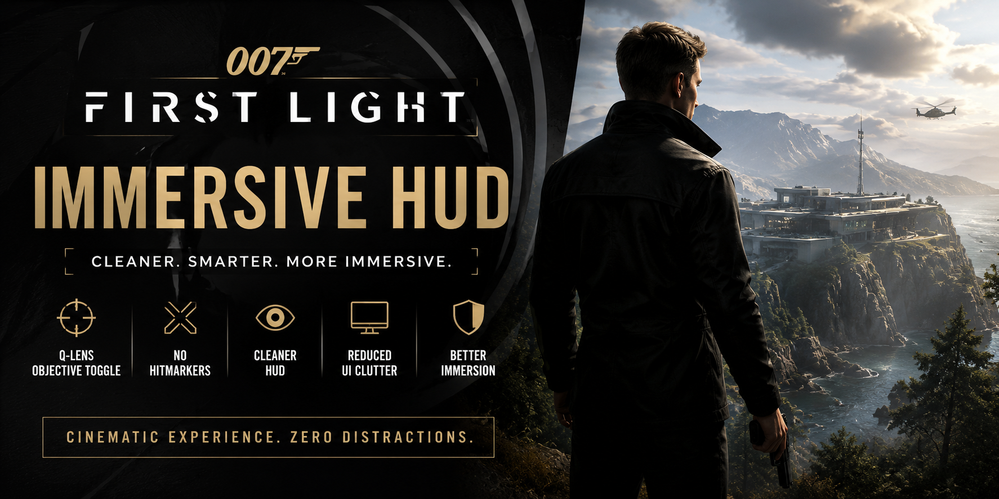
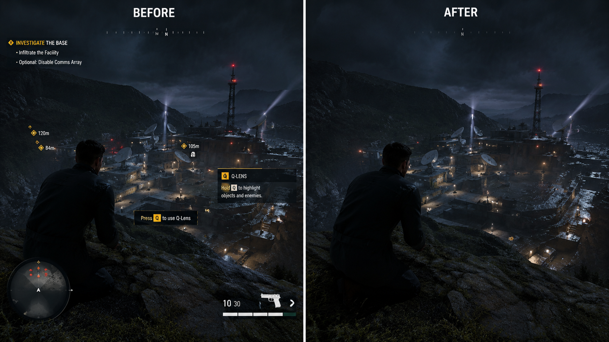

# 007-First-Light-Immersive-HUD
Immersive HUD mod for 007 First Light — Q-lens objective toggle, no hitmarkers, cleaner UI, cinematic HUD, and quality-of-life interface improvements.

# 007 First Light - Immersive HUD

<p align="center">
  
</p>


<p align="center">
  <strong>A cleaner, more immersive HUD experience for 007 First Light.</strong>
</p>

<p align="center">
  Removes distracting UI elements, improves immersion, and delivers a cinematic gameplay experience.
</p>

---

## Features

✔ Toggle objective markers through Q-Lens

✔ Optional removal of hitmarkers

✔ Cleaner HUD presentation

✔ Reduced visual clutter

✔ Better cinematic gameplay feel

✔ Lightweight and performance friendly

✔ Easy installation

✔ Compatible with current game version

---

## Why Use Immersive HUD?

007 First Light delivers a cinematic spy experience, but constant HUD elements can reduce immersion.

This mod helps create a cleaner interface by minimizing unnecessary visual distractions while keeping important gameplay information accessible.

Perfect for:

- Immersive playthroughs
- Screenshot creators
- Content creators
- Cinematic recordings
- Hardcore gameplay sessions

---

## Preview

### Main Gameplay



---

## Installation

1. Download the latest release.
2. Extract the archive.
3. Launch:

```txt
007FirstLight_ImmersiveHUD_Setup.exe
```

4. Follow the installer instructions.
5. Start the game.

---

## Included Files

```txt
007FirstLight_ImmersiveHUD_Setup.exe
README.md
CHANGELOG.md
```

---

## Performance Impact

```txt
CPU Usage: None
GPU Usage: None
Memory Usage: Minimal
Loading Times: Unchanged
```

---

## Compatibility

| Version | Status |
|----------|----------|
| Current Release | Supported |
| Future Updates | Testing Required |

---

## FAQ

### Is this safe?

Yes. The mod only modifies interface behavior and visual presentation.

### Does this affect performance?

No measurable performance impact.

### Can I uninstall it?

Yes. Simply remove the installed files or use the provided uninstaller if available.

---

## Changelog

### v1.3.1

- Improved HUD behavior
- Updated compatibility
- Minor fixes
- Better stability

---

## Support

If you encounter issues:

- Open a GitHub Issue
- Include screenshots when possible
- Describe your game version

---

## Disclaimer

This is a fan-made modification for 007 First Light.

All trademarks, logos, and game assets belong to their respective owners.

---

## Credits

Created for the 007 First Light community.

Special thanks to everyone providing feedback and testing.

---

## Download

Download the latest version from the Releases section.
